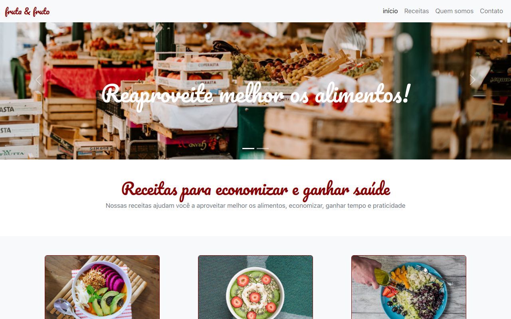

# Fruta&Fruto

Este Site é ficticio. 
<b>Projeto Desenvolvido para treinar Bootstrap</b>.

## 🔨 Funcionalidades do projeto

Você pode passear <a href="https://projeto-fruto-fruta-bootstrap.vercel.app" target="_blank">no Site</a> para entender a arte conceitual do projeto. 
<b>Esse site usa o Framework do Bootstrap </b>

## ✔️ Técnicas e tecnologias utilizadas

Se liga nessa lista de tudo que usaremos nesse Projeto:

- `HTML`
- `CSS`
- `JavaScript`
- `BOOTSTRAP`

E muito mais!

## 🛠️ Abrir e rodar o projeto

Para abrir e rodar o projeto, execute `npm i` para instalar as dependências e `npm start` para inicar o projeto.

Depois, acesse <a href="http://localhost:3000/">http://localhost:3000/</a> no seu navegador.
